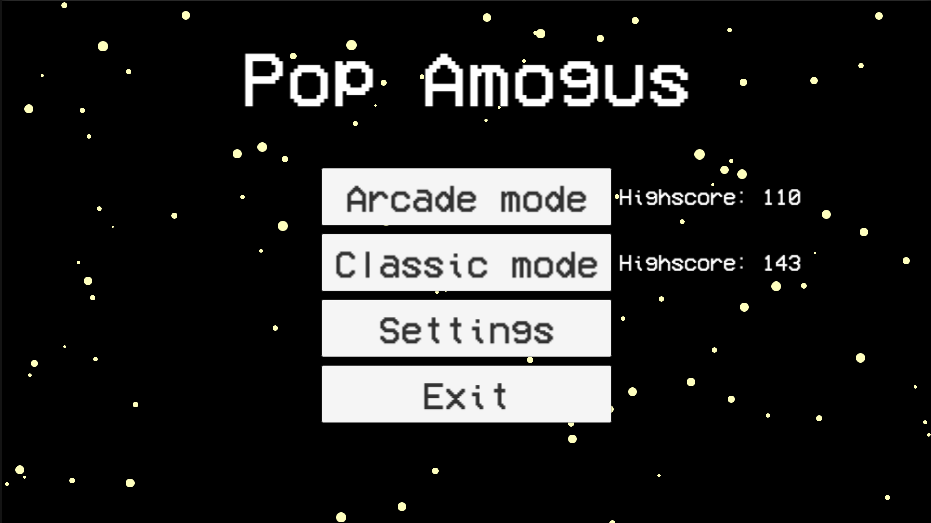
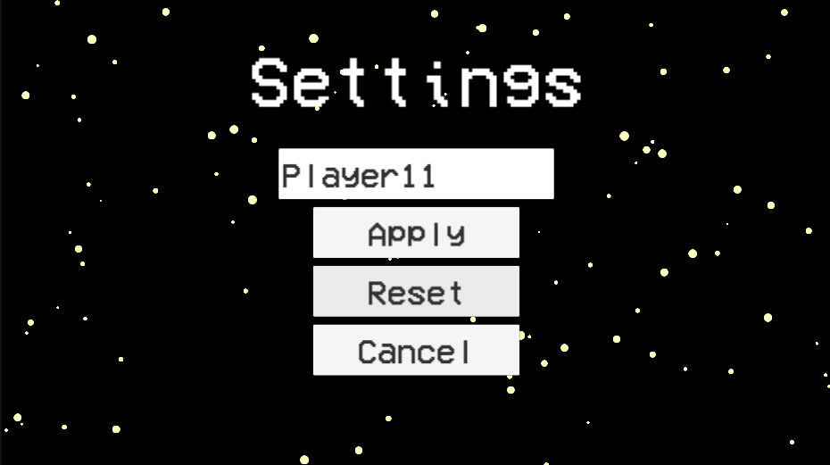
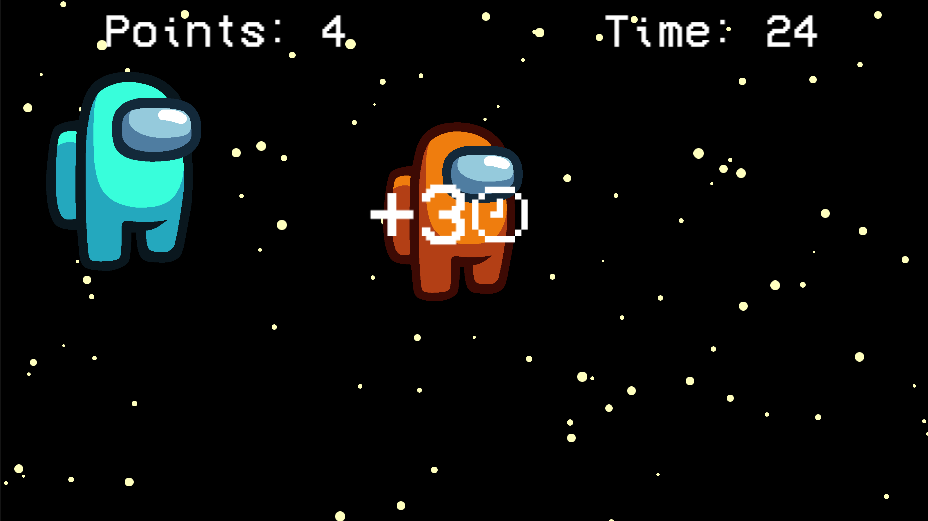

# Домашнее задание (UI и игра на время)
## Игра-кликер
### Главное меню:

В главном меню были добавлены кнопки для начала игры в аркадном режиме (игра на время), настроек и выхода из игры.
Рядом с кнопками начала игры отображается максимальное количество набранных очков в соответсвующих режимах.

### Окно настроек:

На экране настроек можно ввести новое имя пользователя и сбросить прогресс. При нажатии кнопки Apply новое имя пользователя сохраняется.

### Классический режим:

На экране игры отображается количество набранных очков, а также счетчик пропущенных амогусов в виде трех крестиков. Если игрок набирает 3 крестика, то игра заканчивается. При наборе колчества очков кратных 100, один крестик обнуляется.
Также на экране появляются амогусы случайного цвета. На протяжении игры скорость с которой появляются новые амогусы возрастает. При появлении амогус начинает расти и через какое-то время исчезает.
С маленькой вероятностью на экране может появиться импостер (злой амогус). При нажатии на него игра сразу завершается.

### Аркадный режим

В аркадном режиме игра длится определенное время. В данном режиме нет жизней, поэтому пропуск амогусов ничего не делает. Нажатие на импостеров отнимает 10 очков. Также может появиться бонусный амогус, при нажатии на которого к таймеру добавляется 3 секунды. Они растут и исчезают быстрее обычных.

