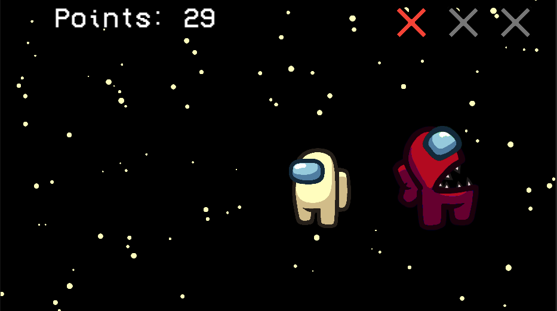

# Домашнее задание 1
## Игра-кликер
### Главное меню:

В главном меню отображается максимальное набранное количество очков, а также находится кнопка чтобы начать игру.

### Игра:

На экране игры отображается количество набранных очков, а также счетчик пропущенных амогусов в виде трех крестиков. Если игрок набирает 3 крестика, то игра заканчивается. При наборе колчества очков кратных 100, один крестик обнуляется.
Также на экране появляются амогусы случайного цвета. На протяжении игры скорость с которой появляются новые амогусы возрастает. При появлении амогус начинает расти и через какое-то время исчезает.
С маленькой вероятностью на экране может появиться импостер (злой амогус). При нажатии на него игра сразу завершается.
